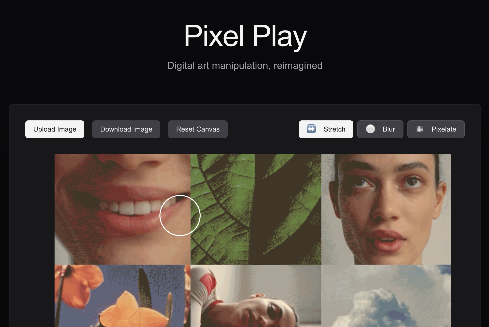

# Pixel Play

A creative tool I made to quickly play around with pixels and their many colors :)

## Features

### Tools

- **Stretch Tool (↔️)**: Click and drag to stretch pixels in any direction
- **Blur Tool (⚪)**: Smoothly blur selected areas
- **Pixelate Tool (▦)**: Create mosaic effects

### Controls

- **Brush Size**: Adjust using the slider or Shift + Scroll
- **Tool Selection**: Click on tool icons to switch between effects
- **Undo**: Ctrl/Cmd + Z to undo last action
- **Reset**: Click "Reset Canvas" to start over

### Image Handling

- **Upload**: Drag and drop images or use the upload button
- **Download**: Save your work with custom file names
- **Quality**: High-quality image processing with minimal quality loss

## Getting Started

1. Upload an image by dragging and dropping or clicking the upload button
2. Select a tool from the toolbar
3. Adjust brush size using the slider or Shift + Scroll
4. Click and drag on the canvas to apply effects
5. Download your creation when finished

## Tips

- Use small brush sizes for detailed work
- Large brush sizes work well for broad effects
- Experiment with different tools to create unique effects
- Use the undo feature (Ctrl/Cmd + Z) to step back through changes

## Development

- Next.js
- TypeScript
- Tailwind CSS
- Canvas API
